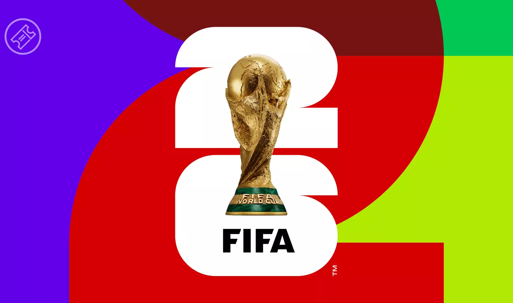

<div align="center">
  
  
  # 🏆 FIFA World Cup 2026 Discord Bot 🏆

  [](https://nodejs.org/)
  [](https://discord.js.org/)
  [](https://www.prisma.io/)
  [](https://www.postgresql.org/)
  [](https://www.typescriptlang.org/)
  [](https://deepmind.google/technologies/gemini/)

  An interactive, gamified Discord bot built for the Indian FIFA World Cup 2026 fan community. Run automated match prediction polls, daily trivia quizzes, leaderboards, and achievements—all fully aligned with Indian Standard Time (IST)!
</div>

---

## 🌟 Key Features

<p align="center">
  
</p>

*   **📝 Automated Daily Quizzes**: Runs daily at **10:35 AM IST**. Gemini AI parses yesterday's stats to generate 10 unique, casual questions. Fallback logic automatically injects historic FIFA trivia if there were no matches. Users participate privately via an announcement containing a green **Start Quiz** button.
*   **🔮 Prediction Polls**: Posted automatically at **10:37 AM IST**. Fans vote on the match winner before kickoff to win **5 FIFA W Coins**.
*   **🇮🇳 Indian Standard Time (IST)**: All timezone operations, daily schedulers, and user-facing clock warnings are tuned perfectly to IST.
*   **📱 Embed-Disabled Fallbacks**: Built-in plain text fallbacks format messages cleanly for users who have link previews and embeds disabled in their Discord chat settings.
*   **💰 Dynamic Economy & Achievements**: A database tracks user coins, prediction wins, quiz durations, and badges (e.g., *Perfect Trivia*, *First Kick*).

---

## 🚀 Setup Instructions

Follow these steps to deploy and run the bot on your local machine or server:

### 1. Prerequisites
Ensure you have the following installed:
*   [Node.js](https://nodejs.org/) (v18 or higher)
*   [PostgreSQL](https://www.postgresql.org/) database running locally or hosted

### 2. Installation
Clone your repository and install npm packages:
```bash
npm install
```

### 3. Configuration
Copy the `.env.example` file to `.env`:
```bash
cp .env.example .env
```
Open `.env` and fill in the required keys:
*   `DISCORD_TOKEN`: Your bot application token.
*   `DATABASE_URL`: PostgreSQL connection string.
*   `GEMINI_API_KEY`: Google Generative AI API key.

> [!WARNING]
> Keep your `.env` file secure and **never** commit it to GitHub. It is already added to `.gitignore`.

### 4. Database Initialization
Deploy database schema and generate Prisma Client:
```bash
npx prisma migrate dev
npx prisma generate
```

### 5. Slash Command Registration
Publish the commands list to Discord servers:
```bash
npm run register
```

### 6. Running the Bot
Launch the bot in development mode:
```bash
npm run dev
```

---

## 🎮 Commands Reference

### 👤 User Commands
These commands are available for all server members:

| Command | Subcommands / Options | Description |
| :--- | :--- | :--- |
| `/quiz` | None | Starts today's daily trivia quiz. Runs privately. |
| `/polls` | None | Displays active predictions, voting status, and poll jump links. |
| `/coins` | `[user]` | View your own or another member's FIFA W Coins balance. |
| `/profile` | `[user]` | Displays comprehensive World Cup profile, quiz records, and achievements. |
| `/leaderboard` | `daily`, `weekly`, `monthly`, `coins` | Shows the high score lists for daily, weekly, monthly quiz points, or coin counts. |

### 🛡️ Admin Commands
These commands require the user to have **Administrator** server permissions:

| Command | Options | Description |
| :--- | :--- | :--- |
| `/adjust-coins` | `user` (req), `amount` (req), `reason` | Modify a user's coin balance (+ or -). |
| `/force-generate-quiz` | None | Triggers immediate daily quiz generation and channel announcement. |
| `/force-generate-polls` | None | Triggers immediate prediction polls generation for today's matches. |
| `/settle-polls` | None | Forces prediction polls settlement and reward distributions for yesterday. |
